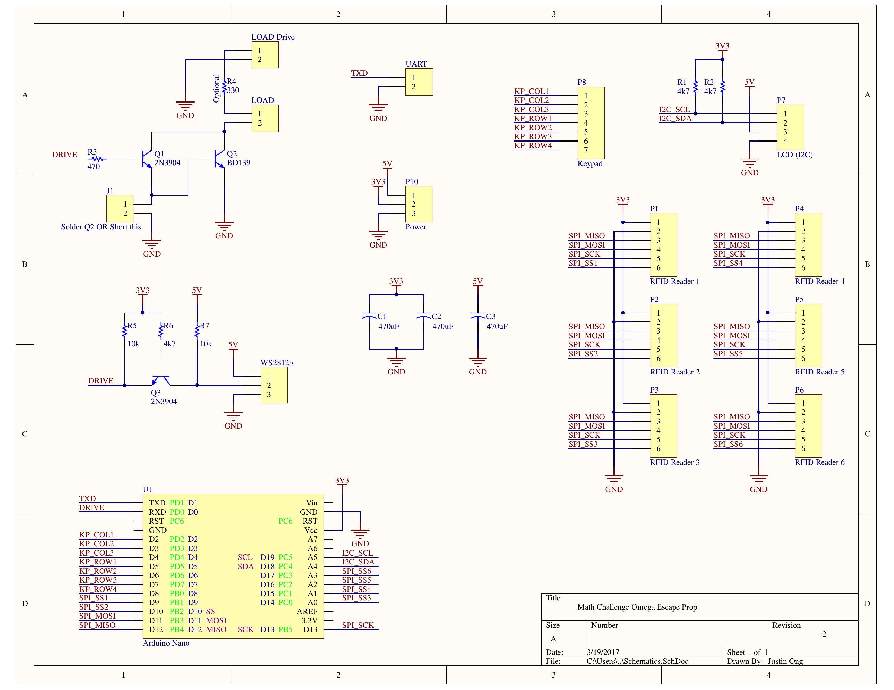
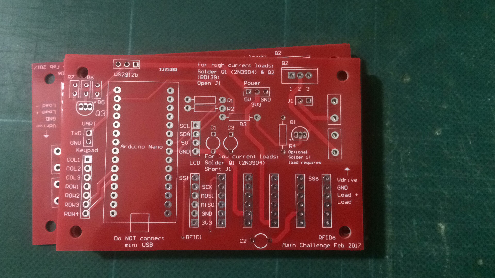
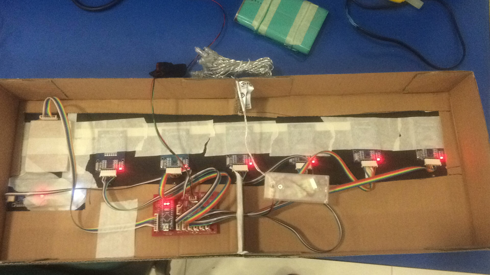

# MC-escape-room

Source code and hardware for a escape room prop I built. First part involves keying in the correct 3 digit code. Second part involves hanging 6 RFID cards on hooks in the correct sequence.

Primary modules used:
* LM2596 DC-DC Step Down: Create 3.3V rail to power everything
* RC522: RFID Reader
* Arduino Nano: Main microcontroller, running at 3.3V so level shifting is not required
* Generic 16x2 LCD with I2C Backpack: Used to display prompts and feedback

The Arduino Nano's were programmed with a 3.3V USBasp (primarily because I wanted to see if I could program it while the Nano was plugged into the board, but turns out it dosent work reliably with all the RFID modules plugged in. Perhaps the USBasp cannot drive the SPI pins hard enough?).

Schematics:

PCB:

Overall layout:

